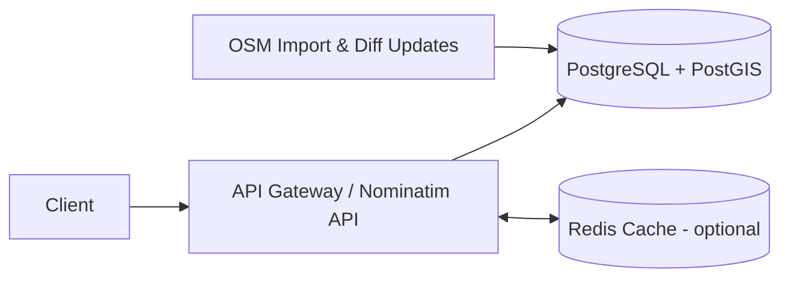
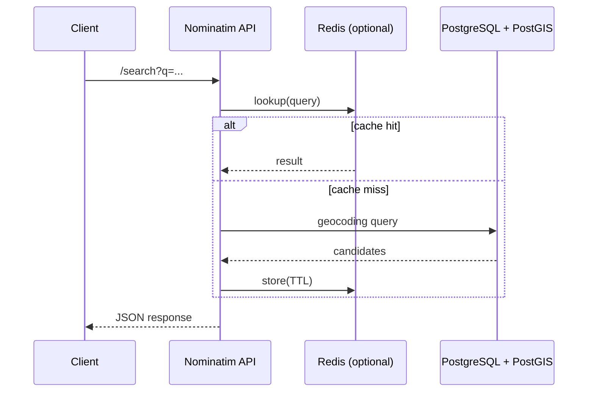

# Nominatim Containerization using Docker

This repository shows a lightweight way to containerize **Nominatim**, the OpenStreetMap geocoder. It focuses on keeping setup simple while leaving room to add data import and production hardening.

## Prerequisites
- Docker (v24+) and Docker Compose
- Git
- ~8 GB RAM recommended for real-world OSM imports

## Quickstart
```bash
git clone https://github.com/Satwikvarma/nominatim-containerization.git
cd nominatim-containerization

# Build the base image and start an interactive container
docker compose build
docker compose up -d
docker compose exec nominatim bash
```

> Tip: You can also use the helper scripts in `scripts/`:
> - `./scripts/build.sh` to build the image
> - `./scripts/run.sh` to start the container

## Project Structure
- `Dockerfile` – builds a minimal Ubuntu 22.04 image with PostGIS and Nominatim sources
- `docker-compose.yml` – brings up the Nominatim container
- `scripts/` – helper scripts for build/run
- `docs/` – installation guide, architecture notes, and results
- `screenshots/` – reference images

## Results
- Successful container build with Nominatim source available inside the container
- Faster repeatable setup compared to manual installation
- Portable, reproducible environment

## Use Cases
- Geospatial applications
- Location‑based services
- Urban planning

## Architecture Overview

This project containerizes **OpenStreetMap Nominatim** for reliable local/production geocoding deployments, including database persistence, import/update workflows, and optional caching/observability.



For full diagrams and detailed flow, see [`docs/architecture.md`](docs/architecture.md).

---

## Geocoding Request Flow (Summary)



For the full sequence (including metrics/error paths), see [`docs/architecture.md`](docs/architecture.md).

---

## Next steps / How to improve this
See [`docs/improvement-guide.md`](docs/improvement-guide.md) for concrete follow-up steps such as adding data import automation, persistent Postgres volumes, non-root execution, and production-ready runtime settings.

## Authors
- Satwik Varma ([GitHub: Satwikvarma](https://github.com/Satwikvarma))
- Sai Sharan Mankala ([GitHub: SharanMankala](https://github.com/SharanMankala))
