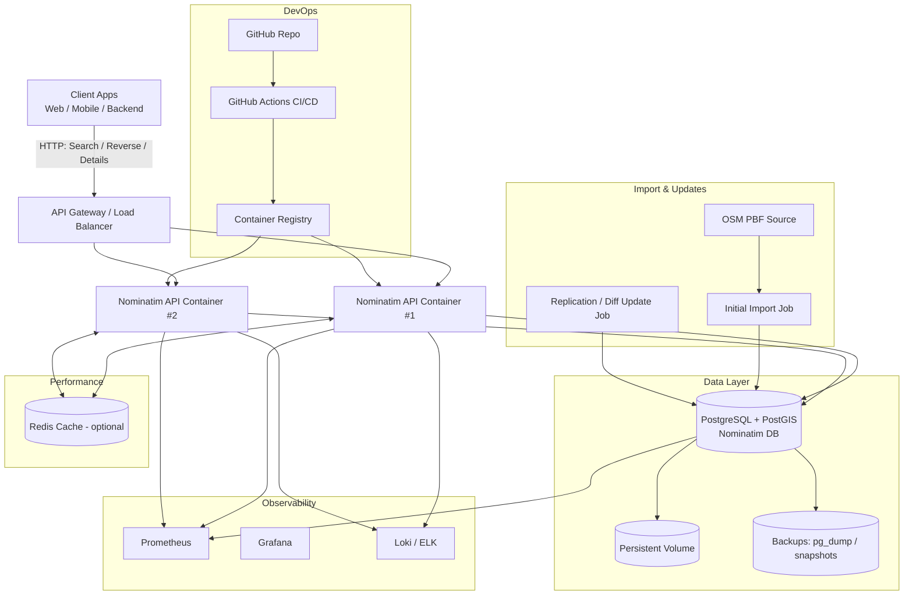
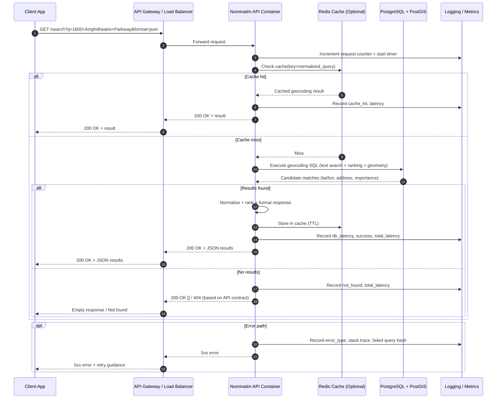

# Architecture

This document explains the high-level architecture and request lifecycle for **nominatim-containerization**.

## 1) System Architecture

---

## 2) Geocoding Sequence Flow (Forward Search)

---

## 3) Core Components

- **Nominatim API containers**: Serve `/search`, `/reverse`, and details endpoints.
- **PostgreSQL + PostGIS**: Stores indexed OSM data and executes geospatial queries.
- **Import/Diff jobs**: Perform initial dataset import and incremental updates.
- **Redis (optional)**: Caches frequent queries to reduce DB load and latency.
- **Observability stack**: Metrics, dashboards, and logs for performance + debugging.

---

## 4) Operational Notes

- Use persistent volumes for database durability.
- Schedule backups (`pg_dump` or volume snapshots).
- Define update cadence for OSM diffs (hourly/daily/weekly depending on use case).
- Add health/readiness checks before exposing service publicly.
- Track P95 latency and error rates for production readiness.

---

## 5) Suggested Future Additions

- **Reverse geocoding sequence** diagram (`/reverse?lat=...&lon=...`)
- **Deployment view** (Docker Compose vs Kubernetes)
- **Failure-mode diagram** (DB unavailable, stale cache, import lag)
